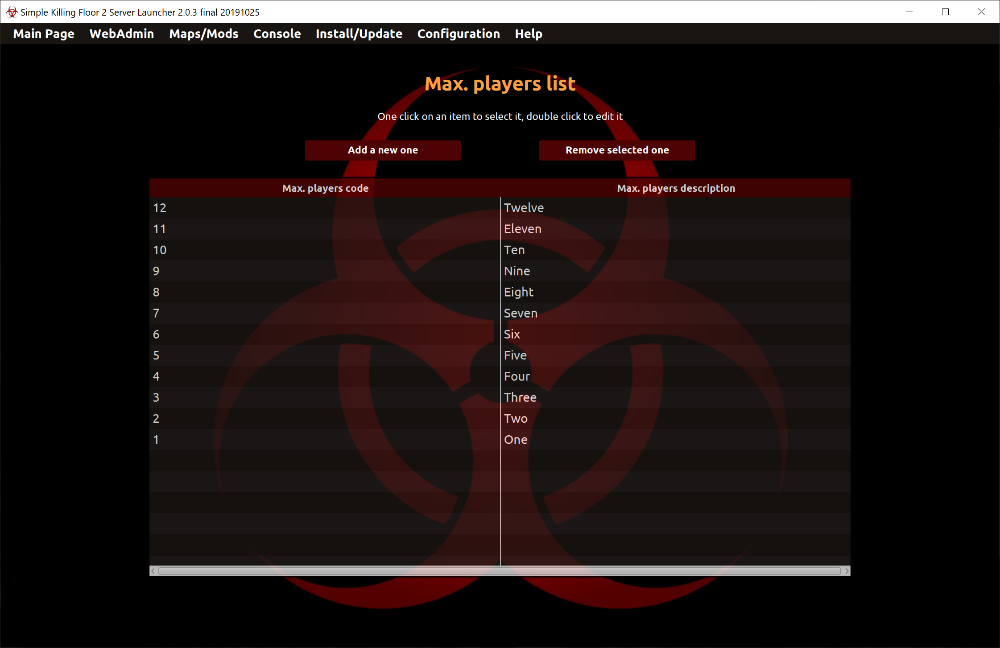

# Configuracion avanzada

## Lista de perfiles
En esta sección puedes gestionar perfiles desde el lanzador. Cada perfil es usado para personalizar tus parámetros del servidor.

* _Doble click en un nombre de perfil_: Permite editar el nombre de perfil.
* Añadir nuevo perfil_: Permite añadir un nuevo perfil. El nombre debe ser único.
* _Clonar el perfil seleccionado_: Permite duplicar el perfil seleccionado a un nuevo perfil.
* _Eliminar perfil seleccionado_: Permite eliminar el perfil seleccionado.
* _Import profiles_: Permite importar perfiles desde fichero al lanzador.
* _Exportar perfiles_: Permite exportar perfiles desde el lanzador a un fichero.

**NOTA**: No se permite duplicación de nombre de perfil en ninguna de las operaciones.

## Lista de tipos de juegos
En esta sección puedes añadir, editar o eliminar tipos de juegos del lanzador. Cada tipo de juego está compuesto por cuatro campos:
1. _Código_: Código para identificar el tipo de juego. No es un texto libre, debe ser exactamente como es descrito en la documentación del servidor de Killing Floor 2. 
2. _Descripción_: Texto libre para identificar el tipo de juego.
3. _Dificultades activas_: Indica si el combo de dificultades está activo o no.
4. _Longitudes activas_: Indica si el combo de longitudes está activo o no.

* _Añadir nuevo tipo de juego_: Permite añadir un nuevo tipo de juego sin duplicidad de código.
* _Doble click en un código o descripción de tipo de juego_: Permite editar el campo.
* _Eliminar el tipo de juego seleccionado_: Permite eliminar el código y descripción del tipo de juego seleccionado.

## Lista de Dificultades
En esta sección puedes añadir, editar o eliminar dificultades del lanzador. Cada dificultad está compuesta por dos campos:
1. _Código_: Código para identificar el tipo de dificultad. No es un texto libre, debe ser exactamente como es descrito en la documentación del servidor de Killing Floor 2. 
2. _Descripción_: Texto libre para identificar el tipo de dificultad. 

* _Añadir nueva dificultad_: Permite añadir una nueva dificultad sin duplicidad de código.
* _Doble click en un código o descripción de dificultad_: Permite editar el campo.
* _Eliminar la dificultad seleccionada_: Permite eliminar el código y descripción de la dificultad seleccionada.

## Lista de Longitudes
En esta sección puedes añadir, editar o eliminar longitudes del lanzador. Cada longitud está compuesta por dos campos:
1. _Código_: Código para identificar el tipo de longitud. No es un texto libre, debe ser exactamente como es descrito en la documentación del servidor de Killing Floor 2. 
2. _Descripción_: Texto libre para identificar el tipo de longitud. 

* _Añadir nueva longitud_: Permite añadir una nueva longitud sin duplicidad de código.
* _Doble click en un código o descripción de longitud_: Permite editar el campo.
* _Eliminar la longitud seleccionada_: Permite eliminar el código y descripción de la longitud seleccionada.

## Lista de maximo jugadores
En esta sección puedes añadir, editar o eliminar el máx.jugadores del lanzador. Cada número máx. jugadores está compuesto por dos campos:
1. _Código_: Código para identificar el máx.jugadores. No es un texto libre, debe ser exactamente como es descrito en la documentación del servidor de Killing Floor 2. 
2. _Descripción_: Texto libre para identificar el máx.jugadores.

* _Añadir nuevo número de máx.jugadores_: Permite añadir un nuevo número de máx.jugadores sin duplicidad de código.
* _Doble click en un código o descripción de máx.jugadores_: Permite editar el campo.
* _Eliminar el máx.jugadores seleccionado_: Permite eliminar el código y descripción del máx.jugadores seleccionado.

---
Back to main page [here](../../LEEME.md).